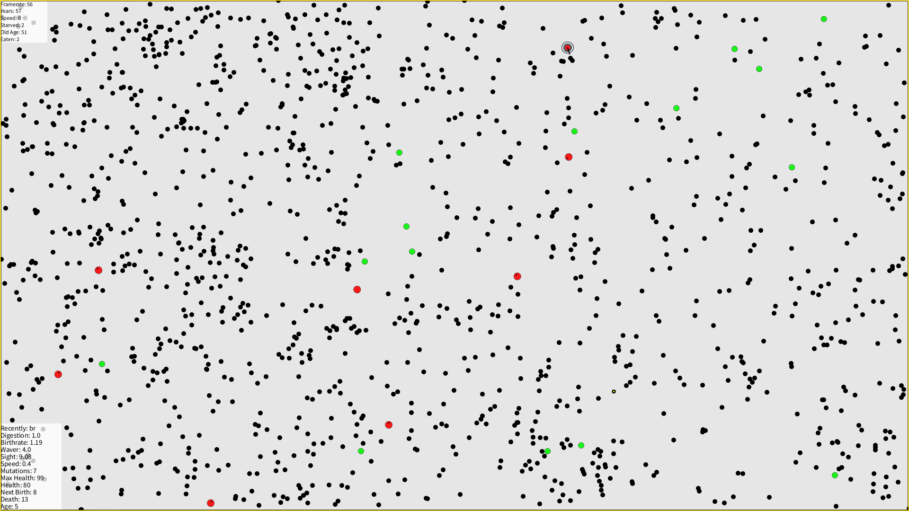

# Terravolve

Terravolve is a Processing based visual evolution simulator. In the simple world of Terra, there are herbivores (green) and carnivores (red) that live in a flat world where food (black dots) spawns sporadically. The creatures must feed or starve, and if they have enough extra health, the herbivores will lay eggs and the carnivores will birth offspring. These children will have mutated features, either increasing or decreasing expression. Over time, only the healthiest creatures will survive and competition between species will push for ever-stronger genes.

## Features

- Select any creature to highlight them and view their specific features in the bottom left corner.
- View creature's viewing distance - creatures with great enough sight will be displayed with an eyeball on their body.
- Press the space key to display statistics on both of the populations overall.
- Control the speed of time with +/- keys.

### Mutatable Features

- Mutation Rate (How much these features get mutated in children)
- Digestion (How well the creatures process food)
- Birthrate (How often the creature produces offspring, which reduces health)
- Waver (How sporadically the creatures move)
- Sight (How far the creatures can see, they will avoid predators and seek food)
- Speed
- Max Health
- Egg Time (Herbivores only, how long to wait before hatching)

## Code Structure

There are classes for carnivores, eggs, food, and herbivores, as well as helper functions for displaying the screen, updating the game state, and calculating the mutations. These classes are stored in separate pde files, as well as a pde file for the helper functions. The main Terravolve V1 pde file contains the setup and draw functions for running the program.

## Getting Started

1. Install [Processing](https://processing.org/download/)
2. Clone this repository
3. Open the main file `Terravolve.pde` in Processing
4. Press the run button to start the simulation

## License

This project is licensed under the MIT License - see the [LICENSE](LICENSE) file for details
